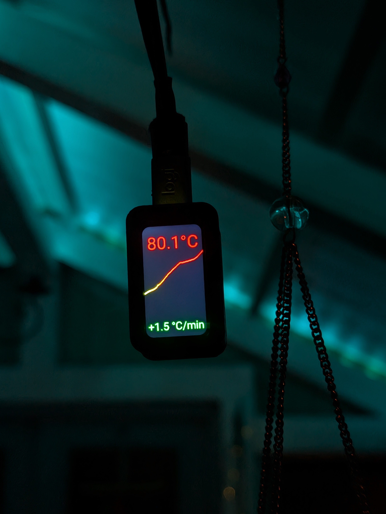

# sauna-monitor
A horribly vibe-coded sauna monitor for a waveshare ESP32 module for use in ESP Home Builder in Home Assistant. 
* It has a color-coded graph that shows the current temperature
* A development setting for testing the graph. 
* The text changes to red once over 80 degrees Celcius. 
* It has a rate-of-change readout that shows the degrees-per-minute trend.

My first project.

### Bill of Materials
| Item | Quantity | Description | Link/Source |
| :--- | :--- | :--- | :--- |
| ESP32 Development Board | 1 | Waveshare ESP32-C6-LCD-1.47 | 
| Temperature Sensor | 1 | DS18B20 | 
| Pull-up for DS18B20| 1 | 4.7kΩ pull-up resistor (2.2kΩ to 10kΩ)  | 
| USB-C cable | 1 |  | 

The black GND of the DS18B20 connects to the GND of your board, the red cable of the DS18B20 goes on the 3.3V pin of your board, and the yellow data wire goes on the pin you specify in the code, here pin 5. The pull-up resistor goes between the red and yellow wire. This is to keep the data line on high for data readout. 
The obj file is straigt from 3ds max, subdivided to avoid whining from the Bambu lab slicer. No clip-ins for the model, just friction fit.

I'm ashamed to say I know nothing about ESP programming yet, but I have used Claude to make sense of my code and gradually grasp the concepts of ESP home builder. If you, an actual human, will look at this code and balk at its crappiness, feel free to make suggestions.

